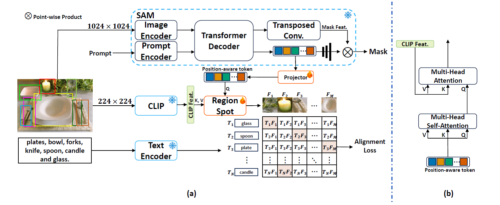

# Recognize Any Regions




> [**Recognize Any Regions**](https://arxiv.org/pdf/2311.01373.pdf)               
> Haosen Yang, Chuofan Ma, Bin Wen, Yi Jiang, Zehuan Yuan, Xiatian Zhu   

## Updates
- **`2023/11/6`**: Code is available Now!

## Models
Method | Box AP_rare| Box AP_all | Mask AP_rare | Mask AP_all  | Download
--- |:---:|:---:|:---: |:---: |:---:
RegionSpot-BB | 19.1 | 20.9 | 17.5 | 17.8| [model](https://surreyac-my.sharepoint.com/:u:/r/personal/hy00610_surrey_ac_uk/Documents/RegionSpot/regionspot_bb.pth?csf=1&web=1&e=8sZBGs)
RegionSpot-BL| 26.0 | 23.7 | 22.8 | 20.2 | [model](https://surreyac-my.sharepoint.com/:u:/r/personal/hy00610_surrey_ac_uk/Documents/RegionSpot/regionspot_bl.pth?csf=1&web=1&e=DJFu00)
RegionSpot-BL@336px | 26.3 | 25.0 | 23.4 | 21.3 | [model](https://surreyac-my.sharepoint.com/:u:/r/personal/hy00610_surrey_ac_uk/Documents/RegionSpot/regionspot_bl_336.pth?csf=1&web=1&e=5YxPzO)


## Getting Started

The installation instruction and usage are in [Getting Started with Recognize Any Regions](GETTING_STARTED.md).

## Demo

First download a model checkpoint. Then the model can be used in just a few lines to get masks from a given prompt:

```bash
from regionspot.modeling.regionspot import build_regionspot_model
from regionspot import RegionSpot_Predictor
custom_vocabulary =  ['<custom>']
clip_type = <clip_type>
regionspot = build_regionspot_model(checkpoint="<path/to/checkpoint>", custom_vocabulary=custom_vocabulary, clip_type=clip_type)
predictor = RegionSpot_Predictor(regionspot)
predictor.set_image(<your_image>)
masks, mask_iou_score, class_score, class_index = predictor.predict(<input_prompts>)
```

See the demo.py on using RegionSpot with box prompts for more details.


## Citing Recognize Any Regions

If you use Recognize Any Regions in your research or wish to refer to the baseline results published here, please use the following BibTeX entry.

```BibTeX
@inproceedings{RegionSpot,
  title={Recognize Any Regions},
  author={Yang, Haosen and Ma, Chuofan and Wen, Bin and Jiang, Yi and Yuan, Zehuan and Zhu, Xiatian},
  journal={arXiv preprint arXiv:2311.01373},
  year={2023}
}
`````
